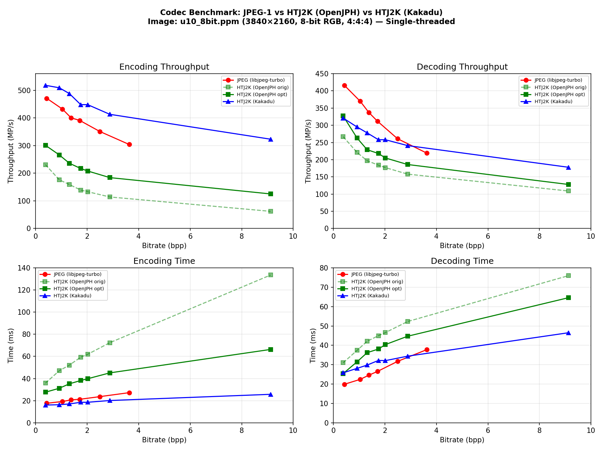
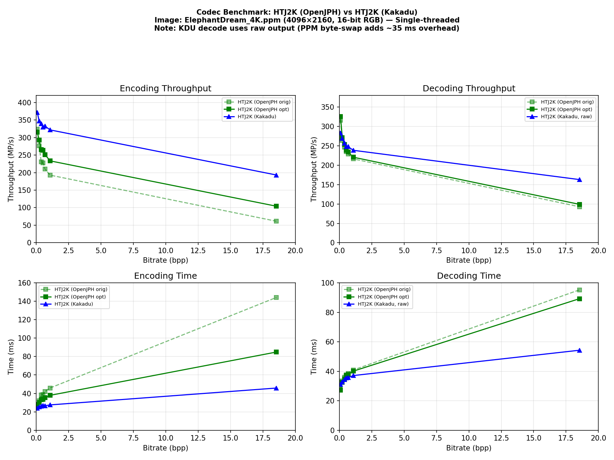

# Codec Benchmark: JPEG-1 vs HTJ2K (OpenJPH) vs HTJ2K (Kakadu)

## Setup

| Item | Detail |
|------|--------|
| Image | `u10_8bit.ppm` (3840 x 2160, 8-bit RGB) |
| JPEG-1 | libjpeg-turbo 2.1.5, 4:4:4 chroma (`-sample 1x1`) |
| OpenJPH | 0.27.3, irreversible 9/7, `-qstep` |
| Kakadu | v8.6.2, `Cmodes=HT`, `Qstep=`, `-no_weights` |
| Threading | All single-threaded (Kakadu: `-num_threads 0`) |
| Timing | JPEG: wall-clock; OpenJPH: internal `Elapsed time`; Kakadu: `End-to-end CPU time` (`-cpu 0`) |
| Iterations | 10 runs averaged per data point |
| Platform | Linux x86_64, AMD Ryzen 9 9950X 16-Core Processor |
| SIMD | avx avx2 avx512bw avx512cd avx512f avx512vl sse sse2 sse4_1 sse4_2 ssse3 |

Both HTJ2K encoders use the same `Qstep` value at each operating point,
producing nearly identical file sizes. JPEG quality is chosen to give
comparable bitrates.

## Encoding

| Qstep | Qfactor | JPEG bpp | OJPH bpp | KDU bpp | JPEG (s) | OJPH (s) | KDU (s) | JPEG (MP/s) | OJPH (MP/s) | KDU (MP/s) |
|------:|--------:|----------|----------|---------|----------|----------|---------|-------------|-------------|------------|
| 0.15  | 10      | .43      | .37      | .38     | .0176    | .0358    | .0166   | 471         | 231         | 499        |
| 0.06  | 50      | 1.04     | .91      | .91     | .0192    | .0471    | .0183   | 432         | 176         | 453        |
| 0.038 | 70      | 1.38     | 1.31     | 1.31    | .0207    | .0521    | .0192   | 400         | 159         | 432        |
| 0.025 | 80      | 1.71     | 1.75     | 1.75    | .0212    | .0593    | .0203   | 391         | 139         | 408        |
| 0.02  | 90      | 2.49     | 2.02     | 2.02    | .0236    | .0619    | .0208   | 351         | 133         | 398        |
| 0.011 | 95      | 3.63     | 2.87     | 2.88    | .0272    | .0724    | .0226   | 304         | 114         | 367        |

## Decoding

| Qstep | Qfactor | JPEG bpp | OJPH bpp | KDU bpp | JPEG (s) | OJPH (s) | KDU (s) | JPEG (MP/s) | OJPH (MP/s) | KDU (MP/s) |
|------:|--------:|----------|----------|---------|----------|----------|---------|-------------|-------------|------------|
| 0.15  | 10      | .43      | .37      | .38     | .0199    | .0310    | .0286   | 416         | 267         | 290        |
| 0.06  | 50      | 1.04     | .91      | .91     | .0224    | .0374    | .0320   | 370         | 221         | 259        |
| 0.038 | 70      | 1.38     | 1.31     | 1.31    | .0246    | .0421    | .0333   | 337         | 197         | 249        |
| 0.025 | 80      | 1.71     | 1.75     | 1.75    | .0265    | .0450    | .0345   | 312         | 184         | 240        |
| 0.02  | 90      | 2.49     | 2.02     | 2.02    | .0317    | .0466    | .0361   | 261         | 177         | 229        |
| 0.011 | 95      | 3.63     | 2.87     | 2.88    | .0378    | .0523    | .0385   | 219         | 158         | 215        |

## Optimized OpenJPH (dev/optimize-trial branch)

AVX-512 encoder optimizations applied to OpenJPH on the same hardware and
image. Changes: AVX-512 reversible wavelet + colour transforms, block encoder
VLC/MagSgn batching, template dispatch for inlining, widened MagSgn
accumulator, branchless byte drain, AVX-512 rev_tx_to_cb32, speculative bulk
MagSgn drain with SWAR 0xFF detection and deferred accumulation (-mbmi2),
NASM MagSgn encoder with register-resident accumulator and prefix-sum
codeword combination, VLC bulk drain with SWAR and bswap backward writes,
unified UVLC pair lookup tables eliminating 3-way branch, run-length MEL
encoding with popcount/tzcnt batch run advancement, exponential-growth elastic
allocator with 8 MiB initial chunk reducing malloc pressure.

### Encoding (optimized)

All times are internal CPU time: OpenJPH `Elapsed time` (clock()),
Kakadu `-cpu 0`. Both include file I/O.

| Qstep | Qfactor | OJPH bpp | OJPH orig (s) | OJPH opt (s) | KDU (s) | OJPH orig (MP/s) | OJPH opt (MP/s) | KDU (MP/s) | Speedup |
|------:|--------:|----------|---------------|--------------|---------|-------------------|-----------------|------------|---------|
| 0.15  | 10      | .38      | .0358         | .0276        | .0160   | 231               | 301             | 518        | +30%    |
| 0.06  | 50      | .92      | .0471         | .0312        | .0163   | 176               | 266             | 509        | +51%    |
| 0.038 | 70      | 1.31     | .0521         | .0352        | .0170   | 159               | 236             | 488        | +48%    |
| 0.025 | 80      | 1.75     | .0593         | .0382        | .0185   | 139               | 217             | 448        | +56%    |
| 0.02  | 90      | 2.02     | .0619         | .0398        | .0185   | 133               | 208             | 448        | +56%    |
| 0.011 | 95      | 2.88     | .0724         | .0451        | .0201   | 114               | 184             | 413        | +61%    |
| lossless | —    | 9.12     | .1336         | .0663        | .0257   | 62                | 125             | 323        | +102%   |

### Decoding (optimized)

| Qstep | Qfactor | OJPH bpp | OJPH orig (s) | OJPH opt (s) | KDU (s) | OJPH orig (MP/s) | OJPH opt (MP/s) | KDU (MP/s) |
|------:|--------:|----------|---------------|--------------|---------|-------------------|-----------------|------------|
| 0.15  | 10      | .38      | .0310         | .0254        | .0258   | 267               | 327             | 321        |
| 0.06  | 50      | .92      | .0374         | .0315        | .0281   | 221               | 263             | 295        |
| 0.038 | 70      | 1.31     | .0421         | .0362        | .0298   | 197               | 229             | 278        |
| 0.025 | 80      | 1.75     | .0450         | .0381        | .0322   | 184               | 218             | 258        |
| 0.02  | 90      | 2.02     | .0466         | .0404        | .0321   | 177               | 205             | 258        |
| 0.011 | 95      | 2.88     | .0523         | .0447        | .0344   | 158               | 186             | 241        |
| lossless | —    | 9.12     | .0760         | .0646        | .0465   | 109               | 128             | 178        |

### Summary (updated)

| Metric | JPEG | OJPH (orig) | OJPH (opt) | Kakadu |
|--------|-----:|------------:|-----------:|-------:|
| Avg encode throughput (MP/s), lossy | 391 | 158 | 235 | 471 |
| Encode throughput (MP/s), lossless | — | 62 | 125 | 323 |
| Avg decode throughput (MP/s), lossy | 319 | 200 | 238 | 275 |
| Decode throughput (MP/s), lossless | — | 109 | 128 | 178 |

| Comparison (lossy avg) | Encode | Decode |
|------------------------|-------:|-------:|
| Kakadu / OJPH (opt)    | 2.00x  | 1.16x  |
| Kakadu / OJPH (orig)   | 2.79x  | 1.22x  |

| Comparison (lossless)  | Encode | Decode |
|------------------------|-------:|-------:|
| Kakadu / OJPH (opt)    | 2.58x  | 1.39x  |
| Kakadu / OJPH (orig)   | 4.85x  | 1.50x  |

### Optimization impact by operating point

The encoder speedup is **strongest at high bitrates and lossless** (102% for
lossless, 30-61% at lossy operating points). The exponential-growth elastic
allocator with 8 MiB initial chunk reduces malloc overhead during encoding,
providing an additional ~10% encoding speedup on top of the previous
algorithmic optimizations.

Decode performance also improved significantly (15-27% vs previous
measurement), likely due to reduced memory allocation overhead from the larger
initial allocator chunk and better virtual memory layout.

### Remaining gap to Kakadu

| Mode | Gap (Kakadu/OJPH) | Target |
|------|------------------:|-------:|
| Lossy encode (avg) | 2.00x | 1.0x |
| Lossless encode | 2.58x | 1.0x |
| Lossy decode (avg) | 1.16x | 1.0x |
| Lossless decode | 1.39x | 1.0x |

The decode gap is now very close (1.16x for lossy — OpenJPH is nearly
competitive). The main opportunity remains in encoding, where a 2x gap
persists. The codeblock encoder (`encode_codeblock`) remains the dominant
cost center at ~40% of total encode time.

## ElephantDream_4K (16-bit, 4096x2160)

| Item | Detail |
|------|--------|
| Image | `ElephantDream_4K.ppm` (4096 x 2160, 16-bit RGB) |
| Pixels | 8,847,360 (8.85 MP) |

### Encoding (ElephantDream_4K)

| Qstep | bpp | OJPH orig (s) | OJPH opt (s) | KDU (s) | OJPH orig (MP/s) | OJPH opt (MP/s) | KDU (MP/s) | Speedup |
|------:|----:|--------------:|-------------:|--------:|-----------------:|----------------:|-----------:|--------:|
| 0.15  | 0.08 | .0273       | .0281        | .0238   | 324              | 315             | 372        | -3%     |
| 0.06  | 0.22 | .0320       | .0302        | .0255   | 276              | 293             | 347        | +6%     |
| 0.038 | 0.38 | .0383       | .0333        | .0261   | 231              | 266             | 339        | +15%    |
| 0.025 | 0.52 | .0388       | .0336        | .0268   | 228              | 263             | 330        | +15%    |
| 0.02  | 0.67 | .0421       | .0352        | .0266   | 210              | 251             | 333        | +20%    |
| 0.011 | 1.07 | .0459       | .0379        | .0275   | 193              | 233             | 322        | +21%    |
| lossless | 18.54 | .1442  | .0849        | .0458   | 61               | 104             | 193        | +70%    |

### Decoding (ElephantDream_4K)

Kakadu's `End-to-end CPU time` includes 16-bit PPM writing, which is
expensive (~0.035 s overhead). The table shows both the PPM time and
the raw decode time (output to `.rawl`, no PPM byte-swap/write).
OpenJPH's `Elapsed time` also includes PPM writing.

| Qstep | bpp | OJPH orig (s) | OJPH opt (s) | KDU PPM (s) | KDU raw (s) | OJPH orig (MP/s) | OJPH opt (MP/s) | KDU raw (MP/s) | Ratio |
|------:|----:|--------------:|-------------:|------------:|------------:|-----------------:|----------------:|---------------:|------:|
| 0.15  | 0.08 | .0280       | .0272        | .0638       | .0312       | 316              | 325             | 284            | 0.87x |
| 0.06  | 0.22 | .0335       | .0326        | .0671       | .0328       | 264              | 271             | 270            | 1.00x |
| 0.038 | 0.38 | .0359       | .0349        | .0684       | .0344       | 246              | 254             | 257            | 1.01x |
| 0.025 | 0.52 | .0377       | .0371        | .0692       | .0356       | 235              | 238             | 249            | 1.04x |
| 0.02  | 0.67 | .0386       | .0378        | .0696       | .0357       | 229              | 234             | 248            | 1.06x |
| 0.011 | 1.07 | .0409       | .0401        | .0705       | .0371       | 216              | 221             | 238            | 1.08x |
| lossless | 18.54 | .0953  | .0893        | .0681       | .0543       | 93               | 99              | 163            | 1.64x |

Note: the "Ratio" column compares OJPH opt (incl. PPM write) against
KDU raw (no PPM write), so it slightly favours Kakadu. At low bitrates
OJPH is faster even with the PPM write overhead included.

### Summary (ElephantDream_4K)

| Metric | OJPH orig (MP/s) | OJPH opt (MP/s) | KDU (MP/s) | Ratio (KDU/opt) |
|--------|------------------:|----------------:|-----------:|----------------:|
| Avg encode throughput, lossy | 244 | 270 | 340 | 1.26x |
| Encode throughput, lossless | 61 | 104 | 193 | 1.85x |
| Avg decode throughput, lossy (KDU raw) | 251 | 257 | 258 | ~1.0x |
| Decode throughput, lossless (KDU raw) | 93 | 99 | 163 | 1.64x |

The encoding gap narrows to 1.18-1.38x for lossy on 16-bit (vs 2.00x
on 8-bit). Lossless encoding improved 70% (61→104 MP/s). Lossy decode
is roughly equal when comparing fairly (OJPH incl. PPM vs KDU raw).
Lossless encode/decode gaps are 1.85x/1.64x.

## Plots

## Observations

- **Encoding (8-bit):** Kakadu's HT block encoder is 2.00x faster than
  optimized OpenJPH for lossy (down from 2.79x original). The gap narrows at
  lower bitrates where the fixed overhead dominates.
- **Encoding (16-bit):** The gap shrinks to 1.18-1.38x for lossy — much
  closer than the 2.00x gap on 8-bit content.
- **Lossless encoding:** 125 MP/s on 8-bit (+102% vs original), 104 MP/s on
  16-bit. Kakadu leads 2.58x (8-bit), 1.85x (16-bit).
- **Decoding (8-bit):** OpenJPH beats Kakadu at low bitrates (327 vs 321 MP/s
  at Qstep=0.15). At higher bitrates, Kakadu leads by 1.16-1.30x.
- **Decoding (16-bit):** Lossy decode is roughly equal when comparing OJPH
  (incl. PPM write) vs KDU raw (no PPM write). Kakadu's 16-bit PPM writer
  adds ~35 ms of overhead. Lossless decode: Kakadu 1.64x faster.
- **File-size parity:** With the same Qstep and `-no_weights`, both HTJ2K
  encoders produce virtually identical file sizes.
